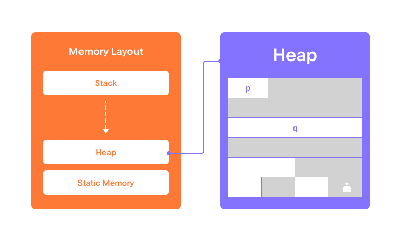

동적 메모리 영역은 정적 및 스택 메모리 영역의 제한을 우회할 수 있도록 해줍니다.  
이를 통해 메모리를 _동적으로_ 그리고 _수동적으로_ 관리할 수 있으며,  
예를 들어 함수 내부에 할당된 변수의 메모리 주소를 호출자에게 반환하는 것이 가능해집니다.  
그러나, 이러한 유연성에는 대가가 따릅니다. 프로그래머는 동적으로 할당된 메모리를  
신중하게 관리하여 다음을 보장해야 합니다:

* 결국에는 메모리가 해제되어 프로그램이 메모리를 소진하는 상황을 피해야 하며,  
* 메모리가 해제된 이후에는 프로그램이 해당 메모리에 다시 접근하지 않아야 합니다 (그렇지 않으면 충돌하거나 쓰레기 값을 읽을 수 있습니다).  

표준 라이브러리의 `malloc` 함수는 메모리 청크를 할당하는 데 사용됩니다.  
이 함수는 할당할 메모리 청크의 크기를 바이트 단위로 요구합니다.  

```c++
// 8 바이트 할당
char* p = (char*) malloc(8);
```

`malloc` 함수는 _형식이 없는_ `void*` 포인터를 반환한다는 점에 유의하세요.  
이를 `char*`와 같은 형식이 있는 포인터로 변환하려면  
__C 스타일 형변환 연산자__ `(char*)`를 사용합니다.  
형변환에 대해서는 이 모듈에서 나중에 더 자세히 논의할 예정입니다.  

할당된 메모리는 __초기화되지 않은 상태__이며,  
사용하기 전에 직접 초기화해야 합니다.  

```c++
for (int i = 0; i < 8; ++i) {
    p[i] = 0;
}
```

특정 유형의 변수 배열을 할당할 때,  
필요한 메모리 크기를 계산하기 위해 `sizeof` 연산자를 사용하는 것이 일반적입니다.  

```c++
// 정수 8개를 할당
int* q = (int*) malloc(8 * sizeof(int));
```

`malloc`에 전달된 크기가 `0`인 경우, 결과는 정의되지 않습니다.  
널 포인터일 수 있지만, 널이 아닌 포인터를 반환할 수도 있습니다. 이 경우  
이 포인터를 역참조하거나 해제하는 것은 허용되지 않습니다.  

```c++
// 결과가 정의되지 않음
int* r = (int*) malloc(0);
```

이미 할당된 메모리 청크를 해제하려면 `free` 함수를 사용합니다.  
이 함수는 해제할 메모리 청크의 포인터를 단일 인수로 받습니다.  

```c++
free(p);
free(q);
```

더 이상 필요하지 않은 메모리는 __해제__하는 것이 매우 중요합니다.  
그렇지 않으면 메모리가 낭비되며, 많은 양의 메모리가 낭비되면  
프로그램이 메모리 부족 상태에 처할 위험이 있습니다.  

