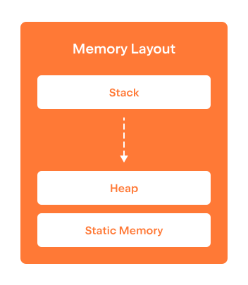

지금까지 우리는 프로그램의 메모리가 개별적으로 주소 지정 가능한 메모리 셀로 구성된다는 것을 배웠습니다.  
또한 메모리에서 변수의 주소를 가져오는 방법과 이를 포인터를 사용하여 저장하거나 이동하는 방법도 배웠습니다.  
하지만 아직 배우지 않은 것은 변수들이 차지하고 있는 메모리가 더 이상 필요하지 않을 때, 그 메모리를  
어떻게 할당하고 해제하는지에 관한 내용입니다.  
일상생활에서 자원을 재활용하는 것이 중요하듯이, 프로그램의 메모리를 재활용하는 것도 매우 중요합니다.  
새로운 변수를 위해 메모리를 계속 할당만 하고, 이를 해제하지 않는다면,  
결국 사용자의 시스템에서 사용 가능한 모든 메모리를 소진하게 될 수 있습니다.

대부분의 현대 프로그래밍 언어에서는 메모리 해제가 프로그래머의 개입 없이  
자동으로 처리됩니다. 이는 "가비지 컬렉터([garbage collector](https://en.wikipedia.org/wiki/Garbage_collection_(computer_science)))"라 불리는  
언어 하위 시스템에 의해 이루어집니다.  
이러한 방식은 프로그래머가 메모리를 수동으로 관리해야 하는 부담을 덜어주기 때문에 매우 편리하지만,  
가비지 컬렉션에는 몇 가지 비용이 따릅니다:

* 사용되지 않는 메모리를 검색하기 위해 프로그램 런타임 일부를 소비하며,  
* 예상치 못한 중단이 발생할 수 있어 프로그램의 응답성과 처리량에 부정적인 영향을 미칠 수 있습니다.

C++는 프로그램 실행 방식에 대해 프로그래머에게 최대한의 제어권을 제공합니다.  
여기에는 메모리 할당 및 해제를 수동으로 관리할 수 있는 가능성도 포함됩니다.

C++에서는 서로 다른 메모리 관리 정책에 의해 관리되는 세 가지 주요 메모리 영역이 있습니다:

* 글로벌 정적 메모리,  
* 스택 메모리,  
* 그리고 동적 힙 메모리.  

다음 단계에서는 이 세 가지에 대해 자세히 배워보겠습니다.

