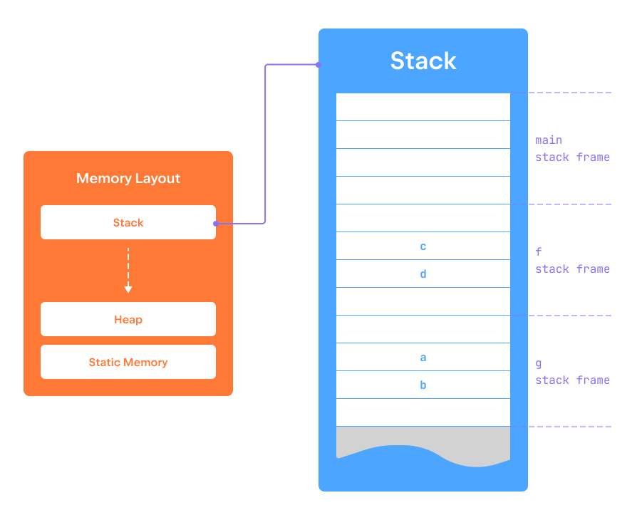

함수 내부에서 선언된 지역 변수는 __스택__ 메모리 영역에 저장됩니다.  
이 메모리 영역은 _스택 프레임_이라고 불리는 조각들로 나뉘어져 있습니다.  
함수가 호출될 때마다, 해당 함수의 모든 지역 변수를 포함한 스택 프레임이  
스택의 최상단에 푸시됩니다.  
그리고 함수 실행이 종료되면, 해당 함수에 해당하는 스택 프레임이  
스택에서 팝됩니다.  

이 메모리 영역의 메모리 관리 정책은   
[스택 자료 구조](https://en.wikipedia.org/wiki/Stack_(abstract_data_type))를 닮았기 때문에  
이름이 그렇게 지어졌습니다.   

이번 단계에 첨부된 프로그램은 두 개의 함수를 정의합니다:  
`f`와 `g`, 각각 두 개의 지역 변수를 선언하고  
그들의 주소를 출력합니다.  
함수 `g`는 `f`에서 호출되고,  
`f`는 메인 함수에서 호출됩니다.  
프로그램을 실행하여 이러한 변수에 할당된 주소를 확인하세요.  
주소가 단조롭게 증가하거나  
(시스템에 따라 감소)하는 것을 주의 깊게 보며,  
이를 통해 메모리 공간 내 스택 성장 방향을 확인할 수 있습니다.

