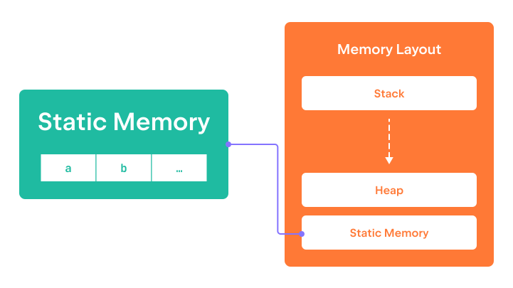

정적 메모리는 모든 전역 변수와 프로그램 코드 자체를 포함합니다.  
정적 메모리는 프로그램 시작 시 할당되고 초기화되며,  
프로그램이 종료될 때에만 해제됩니다.  
따라서 이 영역의 메모리는 프로그램 실행 전체 기간 동안 사용할 수 있습니다.

이 단계에 첨부된 프로그램은 두 개의 전역 변수를 정의하고,  
그 변수들의 주소를 터미널에 출력합니다.  
이 프로그램을 실행하여 이러한 변수들에 할당된 주소를 확인해 보세요.

